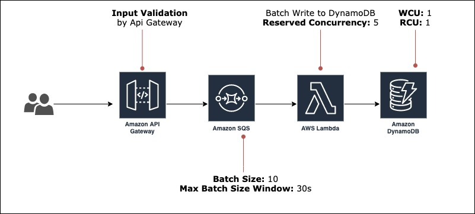

Serverless Framework with TypeScript using API Gateway with SQS endpoint to batch write to DynamoDB

Tools used:

- [`serverless-esbuild`](https://github.com/floydspace/serverless-esbuild) to transpiled TypeScript and module bundler
- [`serverless-apigateway-service-proxy`](https://github.com/serverless-operations/serverless-apigateway-service-proxy) to connect Api Gateway directly to SQS
- Using Serverless Framework [`resources.extensions`](https://www.serverless.com/framework/docs/providers/aws/guide/resources#override-aws-cloudformation-resource) to add input validation to the SQS endpoint

;
